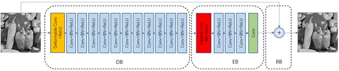

# RDDCNN 
This is the official code of CAAI Transactions on Intelligence Technology paper :<br>
[A robust deformed CNN for image denoising]()<br>



## Requirements
- Python 3.7
- pytorch 1.1
- cuda 10.0
- cudnn 7

## Dataset
### Training sets
The training set of gray noisy images can be downloaded at [here](https://drive.google.com/file/d/1NlmMR4RtWBar04stavxuAserPryGfoT0/view?usp=sharing).  
The training set of real noisy images can be downloaded at [here](https://drive.google.com/file/d/1zsYoxREQx8EcP0THS9ZqNehriegaqoxz/view?usp=sharing).
### Test sets
The test set BSD68 of gray noisy images can be downloaded at [here](https://drive.google.com/file/d/1lxXQ_buMll_JVWxKpk5fp0jduW5F_MHe/view?usp=sharing).  
The test set Set12 of gray noisy images can be downloaded at [here](https://drive.google.com/file/d/1cpQwFpNv1MXsM5bJkIumYfww8EPtlkWf/view?usp=sharing).  
The test set CC of real noisy images can be downloaded at [here](https://drive.google.com/file/d/17DE-SV85Slu2foC0F0Ftob5VmRrHWI2h/view?usp=sharing ).  

## Training
For training with gray images with known noise level, run the following training example:
```shell
CUDA_VISIBLE_DEVICES=0 python gray/train.py --sigma $SIGMA --mode S --train_data $YOUR_SET_PATH
```
For training with gray images with unknown noise level, run the following training example:
```shell
CUDA_VISIBLE_DEVICES=0 python gray/train.py --sigma $SIGMA --mode B --train_data $YOUR_SET_PATH
```
For training with real images, run the following training example:
```shell
CUDA_VISIBLE_DEVICES=0 python real/train_r.py --sigma $SIGMA --mode B --train_data $YOUR_SET_PATH
```

## Validation
We provide pretrained models on Google Drive for validation.  
The model trained with gray noisy images at noise level 15: [download](https://drive.google.com/file/d/1T-DvCBR97ZS9_QexC2kPzh8gsCuPW6d0/view?usp=sharing)  
The model trained with gray noisy images at noise level 25: [download](https://drive.google.com/file/d/16AmrwkGSxJCJcJbmPgGIJT-Ej8KW4RJ9/view?usp=sharing)  
The model trained with gray noisy images at noise level 50: [download](https://drive.google.com/file/d/1uLXr6DQdbY3bHfnC9O3WxCoLkY6GD11t/view?usp=sharing)  
The model trained with gray noisy images with unknown noise level: [download](https://drive.google.com/file/d/1Z2sUN2hflaRy9YsZZ7Z0ELJqTQMgeSjH/view?usp=sharing)  
The model for real noisy images: [download](https://drive.google.com/file/d/1fA2Pz-y2ytW7igg0ItlB_qW829ce52tS/view?usp=sharing)

For RDDCNN trained with known noise level images, run the following validation example:
```shell
CUDA_VISIBLE_DEVICES=0 python gray/test.py --sigma $SIGMA --mode S --model_dir $YOUR_MODEL_PATH --set_dir $YOUR_SET_PATH
```
For RDDCNN trained with unknown noise level images, run the following validation example:
```shell
CUDA_VISIBLE_DEVICES=0 python gray/test.py --sigma $SIGMA --mode B --model_dir $YOUR_MODEL_PATH --set_dir $YOUR_SET_PATH
```
For RDDCNN trained with real noise image, run the following validation example:
```shell
CUDA_VISIBLE_DEVICES=0 python real/test_r.py --model_dir $YOUR_MODEL_PATH --set_dir $YOUR_SET_PATH
```

## Experimental results
### Denoising results of different methods on BSD68 for noise level of 25

### Comparisons of deformable convolution and common convolution

### PSNR (dB) results of several networks on BSD68 for noise level of 15, 25, and 50

### Average PSNR (dB) results of different methods on Set12 with noise levels of 15, 25 and 50

### Complexity of different denoising methods

### Running time (s) of different methods for  256×256, 512×512, and 1024×1024

### Average PSNR (dB) of different denoising methods on CC


## If you cite this paper, please use the following format:  
#### 1..  
#### 2..

## Acknowledgement
We thank 4uiiurz1 (https://github.com/4uiiurz1) for his implementation of Deformable Convolution with PyTorch.
