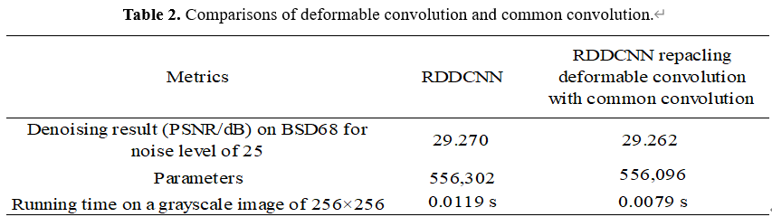
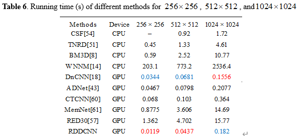
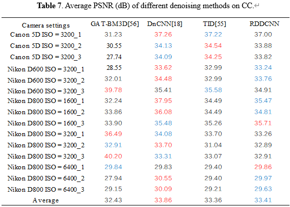
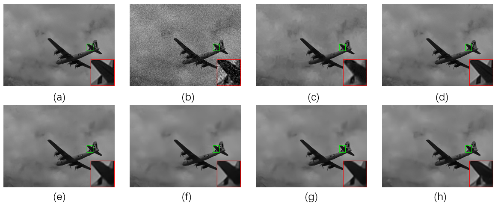
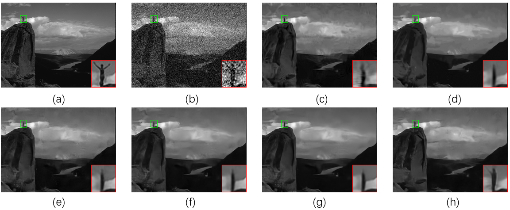
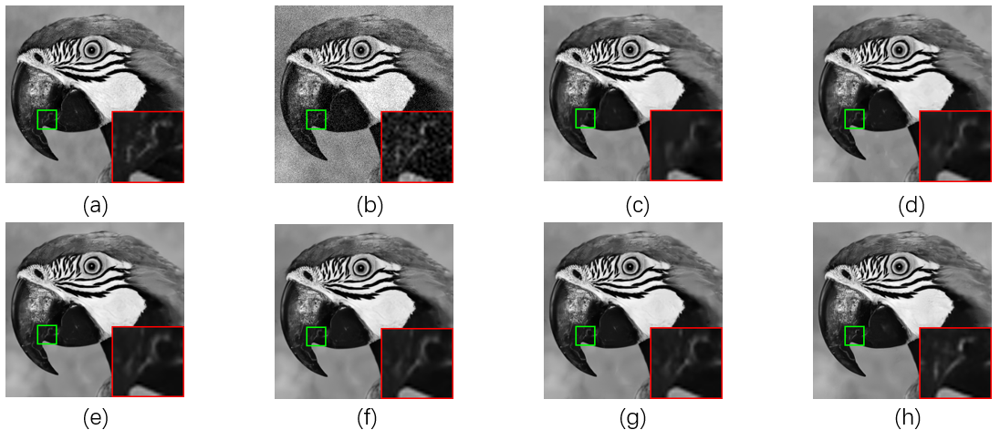

# RDDCNN 
## A robust deformed CNN for image denoising(RDDCNN) by Qi Zhang, Jingyu Xiao, Chunwei Tian, Jerry Chun-Wei Lin and Shichao Zhang is published by CAAI Transactions on Intelligence Technology, 2022 and it is implemented by PyTorch.

## Absract
#### Due to strong learning ability, convolutional neural networks (CNNs) have been developed in image denoising. However, convolutional operations may change original distributions of noise in corrupted images, which may increase training difficulty in image denoising. Using relations of surrounding pixels can effectively resolve this problem. Inspired by that, we propose a robust deformed denoising CNN (RDDCNN) in this paper. The proposed RDDCNN contains three blocks: a deformable block (DB), an enhanced block (EB) and a residual block (RB). The DB can extract more representative noise features via a deformable learnable kernel and stacked convolutional architecture, according to relations of surrounding pixels. The EB can facilitate contextual interaction through a dilated convolution and a novel combination of convolutional layers, batch normalization (BN) and ReLU, which can enhance the learning ability of the proposed RDDCNN. To address long-term dependency problem, the RB is used to enhance the memory ability of shallow layer on deep layers and construct a clean image. Besides, we implement a blind denoising model. Experimental results demonstrate that our denoising model outperforms popular denoising methods in terms of qualitative and quantitative analysis. Codes can be obtained at https://github.com/hellloxiaotian/RDDCNN.

## Requirements
#### Python 3.7
#### Pytorch 1.1
#### cuda 10.0
#### cudnn 7
#### torchvision 
#### openCV for Python
#### HDF5 for Python

## Dataset
### Training sets
#### The training set of gray noisy images can be downloaded at [here](https://drive.google.com/file/d/1NlmMR4RtWBar04stavxuAserPryGfoT0/view?usp=sharing).  
#### The training set of real noisy images can be downloaded at [here](https://drive.google.com/file/d/1zsYoxREQx8EcP0THS9ZqNehriegaqoxz/view?usp=sharing).
### Test sets
#### The test set BSD68 of gray noisy images can be downloaded at [here](https://drive.google.com/file/d/1lxXQ_buMll_JVWxKpk5fp0jduW5F_MHe/view?usp=sharing).  
#### The test set Set12 of gray noisy images can be downloaded at [here](https://drive.google.com/file/d/1cpQwFpNv1MXsM5bJkIumYfww8EPtlkWf/view?usp=sharing).  
#### The test set CC of real noisy images can be downloaded at [here](https://drive.google.com/file/d/17DE-SV85Slu2foC0F0Ftob5VmRrHWI2h/view?usp=sharing ).  

## Training
### For training with gray images with known noise level, run the following training example:
#### CUDA_VISIBLE_DEVICES=0 python gray/train.py --sigma $SIGMA --mode S --train_data $YOUR_SET_PATH
### For training with gray images with unknown noise level, run the following training example:
#### CUDA_VISIBLE_DEVICES=0 python gray/train.py --sigma $SIGMA --mode B --train_data $YOUR_SET_PATH
### For training with real images, run the following training example:
#### CUDA_VISIBLE_DEVICES=0 python real/train_r.py --train_data $YOUR_SET_PATH

## Test
#### We provide pretrained models on Google Drive for validation.  
#### The model trained with gray noisy images at noise level 15: [download](https://drive.google.com/file/d/1T-DvCBR97ZS9_QexC2kPzh8gsCuPW6d0/view?usp=sharing)  
#### The model trained with gray noisy images at noise level 25: [download](https://drive.google.com/file/d/16AmrwkGSxJCJcJbmPgGIJT-Ej8KW4RJ9/view?usp=sharing)  
#### The model trained with gray noisy images at noise level 50: [download](https://drive.google.com/file/d/1uLXr6DQdbY3bHfnC9O3WxCoLkY6GD11t/view?usp=sharing)  
#### The model trained with gray noisy images with unknown noise level: [download](https://drive.google.com/file/d/1Z2sUN2hflaRy9YsZZ7Z0ELJqTQMgeSjH/view?usp=sharing)  
#### The model for real noisy images: [download](https://drive.google.com/file/d/1fA2Pz-y2ytW7igg0ItlB_qW829ce52tS/view?usp=sharing)

### For RDDCNN trained with known noise level images, run the following validation example:
#### CUDA_VISIBLE_DEVICES=0 python gray/test.py --sigma $SIGMA --mode S --model_dir $YOUR_MODEL_PATH --set_dir $YOUR_SET_PATH
### For RDDCNN trained with unknown noise level images, run the following validation example:
#### CUDA_VISIBLE_DEVICES=0 python gray/test.py --sigma $SIGMA --mode B --model_dir $YOUR_MODEL_PATH --set_dir $YOUR_SET_PATH
### For RDDCNN trained with real noise image, run the following validation example:
#### CUDA_VISIBLE_DEVICES=0 python real/test_r.py --model_dir $YOUR_MODEL_PATH --set_dir $YOUR_SET_PATH

## Experimental results
### 1.Denoising results of different methods on BSD68 for noise level of 25

### 2.Comparisons of deformable convolution and common convolution

### 3.PSNR (dB) results of several networks on BSD68 for noise level of 15, 25, and 50

### 4.Average PSNR (dB) results of different methods on Set12 with noise levels of 15, 25 and 50

### 5.Complexity of different denoising methods

### 6.Running time (s) of different methods for  256×256, 512×512, and 1024×1024

### 7.Average PSNR (dB) of different denoising methods on CC

## Visual results
### Denoising results of different methods on one image from BSD68 when noise level 25. (a) Original image (b) Noisy image/20.19 dB (c) BM3D /36.59 dB (d) WNNM /37.22 dB (e) IRCNN /38.17 dB (f) FFDNet /38.41 dB (g) DnCNN /38.45 dB (h) RDDCNN/38.64 dB.

### Denoising results of different methods on one image from BSD68 when noise level is 50. (a) Original image (b) Noisy image/14.66 dB (c) BM3D /29.87 dB (d) WNNM /30.07 dB (e) IRCNN /30.33 dB (f) DnCNN /30.48 dB (g) FFDNet /30.56 dB (h) RDDCNN/30.67 dB.

### Denoising results of different methods on one image from Set12 when noise level is 15. (a) Original image (b) Noisy image/24.60 dB (c) BM3D /31.37 dB (d) WNNM /31.62 dB (e) FFDNet /31.81 dB (f) DnCNN /31.83 dB (g) IRCNN /31.84 dB (h) RDDCNN/31.93 dB

